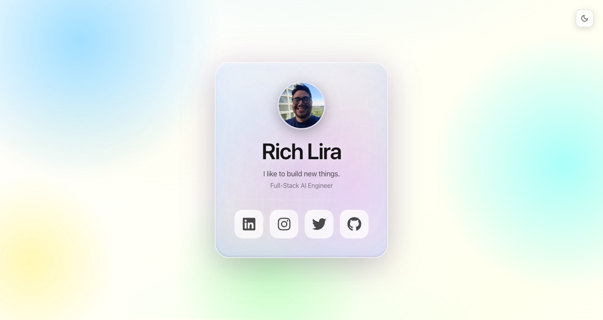
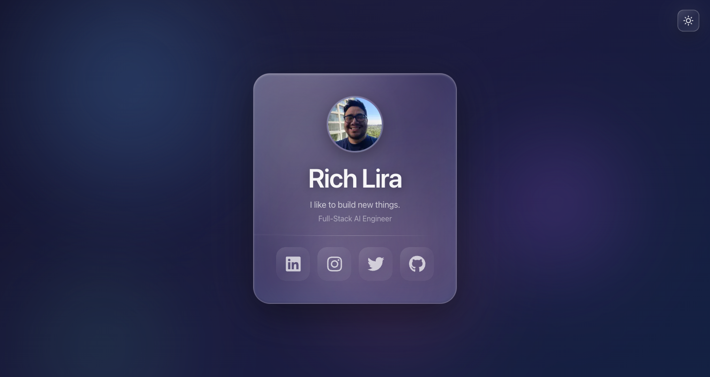
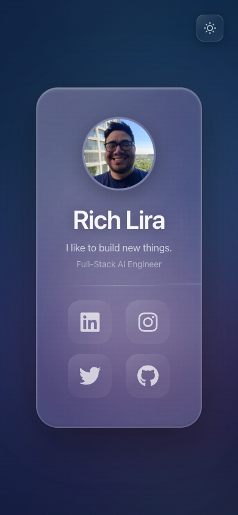

<div align="center">

# 🚀 richlira.dev

**Personal portfolio website for Rich Lira, Full-Stack AI Engineer**

[](https://nextjs.org/)
[](https://www.typescriptlang.org/)
[](https://tailwindcss.com/)
[](https://vercel.com/)

[**🌐 Live Site**](https://richlira.dev) · [**💼 LinkedIn**](https://www.linkedin.com/in/ricardolira/) · [**🐦 Twitter**](https://twitter.com/soyrichlira)

</div>

---

## ✨ Features

- **🌓 Automatic Dark/Light Mode** — Detects system preference and applies the correct theme instantly
- **🎨 Glassmorphism Design** — Modern frosted glass effect with animated gradient background
- **📱 Fully Responsive** — Optimized for all devices from mobile to desktop
- **⚡ Lightning Fast** — Built with Next.js 16 Turbopack for instant page loads
- **🔗 Social Links** — Quick access to LinkedIn, Instagram, Twitter, and GitHub
- **📊 Analytics & Speed Insights** — Integrated Vercel Analytics and Speed Insights

---

## 🖼️ Screenshots

<div align="center">

### Light Mode ☀️



### Dark Mode 🌙



### Mobile View 📱



</div>

---

## 🛠️ Tech Stack

| Category | Technology |
|----------|------------|
| **Framework** | [Next.js 16](https://nextjs.org/) with App Router & Turbopack |
| **Styling** | [Tailwind CSS 4](https://tailwindcss.com/) |
| **Icons** | [FontAwesome](https://fontawesome.com/) (React) |
| **Language** | TypeScript |
| **Analytics** | [Vercel Analytics](https://vercel.com/analytics) |
| **Performance** | [Vercel Speed Insights](https://vercel.com/docs/speed-insights) |
| **Deploy** | [Vercel](https://vercel.com/) |

---

## 📁 Project Structure

```
src/
├── app/
│   ├── globals.css        # Global styles with theme variables
│   ├── layout.tsx         # Root layout with metadata & analytics
│   └── page.tsx           # Home page with profile card
├── components/
│   ├── Navbar.tsx         # Social links navigation grid
│   ├── ThemeToggle.tsx    # Dark/Light mode toggle
│   ├── LiquidGlassEffect.tsx
│   └── MeshBackground.tsx
├── data/
│   └── navbarData.ts      # Social media links configuration
└── types/
    └── navbar.ts          # TypeScript interfaces
```

---

## 🚀 Getting Started

### Prerequisites

- Node.js 18+ 
- npm or pnpm

### Installation

```bash
# Clone the repository
git clone https://github.com/richlira/richlira.dev.git

# Navigate to directory
cd richlira.dev

# Install dependencies
npm install
```

### Development

```bash
# Start development server with Turbopack
npm run dev
```

Open [http://localhost:3000](http://localhost:3000) to view the site.

### Production Build

```bash
# Build for production
npm run build

# Start production server
npm run start
```

---

## 🎨 Customization

### Adding Social Links

Edit `src/data/navbarData.ts`:

```typescript
export const navbarData = [
  {
    name: 'linkedin',
    url: 'https://www.linkedin.com/in/your-profile/',
    icon: 'linkedin',
  },
  // Add more links here
];
```

### Theme Colors

Edit CSS variables in `src/app/globals.css`:

```css
:root {
  --bg-base: #0a0a1a;
  --card-bg: rgba(30, 30, 50, 0.7);
  --text-primary: #ffffff;
  /* ... more variables */
}
```

---

## 📦 Deploy

This project is optimized for Vercel deployment:

1. Push to `main` branch
2. Vercel automatically builds and deploys
3. Preview deployments for pull requests

[](https://vercel.com/new/clone?repository-url=https://github.com/richlira/richlira.dev)

---

## 📄 License

MIT © [Rich Lira](https://richlira.dev)

---

<div align="center">

**Built with ❤️ by [Rich Lira](https://richlira.dev)**

[](https://www.linkedin.com/in/ricardolira/)
[](https://www.instagram.com/richlira/)
[](https://twitter.com/soyrichlira)
[](https://github.com/richlira)

</div>
